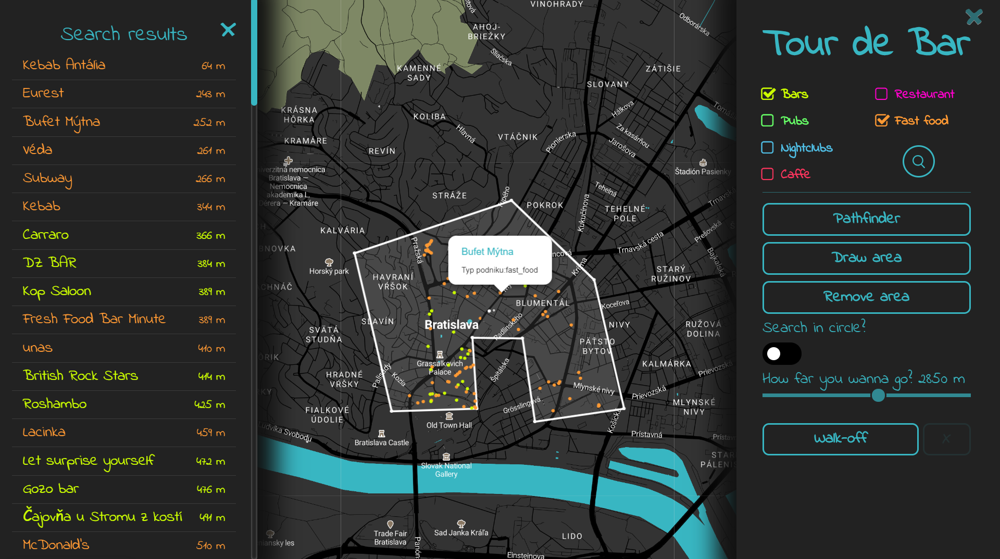
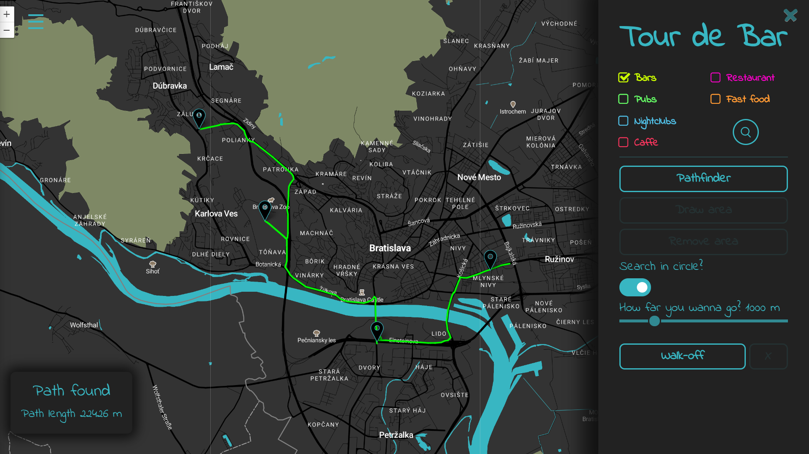
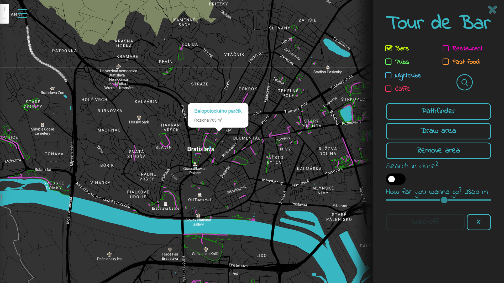

# Overview

Táto aplikácia, je určená pre tých, ktorí si chcú na voľný víkendový večer naplánovať "Tour de Bar", prípadne len hľadajú miesto kam ísť po práci vypnúť. Aplikácia tieto miesta zobrazí na mape s doplňujúcimi informáciami. Konkrétne aplikácia umožňuje nasledujúce:
- vyhľadať bary, nalievarne, nočné kluby, kaviarne, reštaurácie a rýchle občerstvenie,
- vyššie uvedené podniky je možné vyhľadať v okruhu od zvoleného bodu alebo v oblasti, ktorej hranice určí používateľ,
- zobrazenie podnikov priamo na mape, ale aj v mennom zozname so vzdialenosťou od stredu oblasti vyhľadávania (čo je výhodné hlavne z dôvodu, že aplikácia využíva geo lokáciu),
- vyhľadanie trasy medzi dvomi alebo viacerými bodmi na mape, jej zobrazenie a výpočet dĺžky tejto trasy,
- pre tých, ktorí "už majú dosť", aplikácia umožňuje zobraziť parky spolu s najdlhším chodníkom, ktorý ich pretína.

Ukážka vyhľadávania v aplikácii, konkrétne v oblasti určenej používateľom.



Ukážka vyhľadávania trasy medzi viacerými bodmi.



Ukážka vyhľadávania parkov.



Aplikácia je postavená na klient-server architektúre. Klientská časť používa na zobrazenie mapy mapbox API prostredníctvom knižnice mapbox.js, elementy sú na mape spravované leaflet.js knižnicou. Serverová časť je implementovaná frameworkom node.js. Ako databáza je použitá databáza PostgreSQL s rozšírením PostGIS. Kleintská časť komunikuje so serverom prostredníctvom AJAX volaní.

# Frontend

Klientska časť je dynamická HTML stránka (`views/index.html`), ktorá zobrazuje mapbox mapu. Používateľské rozhranie je tvorené dvomi výsuvnými panelmi po stranách obrazovky. Pravý panel slúži na zadávanie dopytov a v ľavom sú zobrazené výsledky dopytu vo forme zoznamu. Ovládacie prvky, dynamika stránky, zobrazenie výsledkov hľadania a AJAX volania sú spravované javascriptom v súbore `assets/js/app.js`.
Štýl mapy som prebral zo šablóny Dark a upravil som ju tak, aby si mi hodila k farebnému dizajnu stránky. Ďalej som upravil štýly textov a zmenil veľkosť fontov pri priblížení mapy. Taktiež som upravil farby ciest a plôch, ktoré nie sú pre tento projekt podstatné.

# Backend

Serverová časť je postavená na frameworku node.js, ako bolo spomenuté už vyššie. Zabezpečuje získavanie dát z databázy, ich spracovanie a odoslanie klientovi. Dopyty sa parametrizujú a vytvárajú podľa požiadaviek používateľa v module `prepare_statement.js`. Podarilo sa mi nájsť aj query builder Knex.js pre node.js. Jednoduchšie dopyty som dokázal vytvoriť pomocou tohto buildera. Komplikovanejšie dopyty s viacnásobne vnorenými selectmi alebo crossJoinom sa mi nepodarilo vytvoriť cez Knex.js z dôvodu, že nepodporuje crossJoin pre PostgresSQL. Na štastie konektor `pg` na databázu, ktorý vykonáva dopyt overuje dopyt proti prípadnému SQL injection. Po parametrizovaní sú dopyty prostredníctvom konektora `pg` vykonané nad databázou. Rovnako, tomu je aj pri dopytov vytvorených `Knex.js`, ktorý len zaobaluje konektor `pg`.  Výsledok dopytu je následne transformovaný na geojson formát a odoslaný klientovi ako odpoveď na jeho AJAX volanie.

## Data

Dáta sú stiahnuté z Open Street Maps. Stiahol som dáta pre celú oblasť Slovenskej republiky a importoval ich prostredníctvom osm2pgsql.
Pre zrýchlenie dopytov som vytvoril indexy v tabuľkách bodov a polygónov nad stĺpcom 'amenity'. Ďalej bolo potrebné vytvoriť (a filtrovať) zvlášť tabuľku ciest pre rozšírenie 'pgrouting', ktoré hľadá najkratšiu cestu medzi zvolenými bodmi.

## Query

Príklad query: Vyhľadanie parkov a najdlhšieho chodníka v danom parku + výpočet plochy parku v metroch štvorcových a dĺžky chodníka v danom parku

```
with sub as(
  select name, polygon, area, line, len as len from (
    (select name as name, way as polygon, st_area(way) as area from planet_osm_polygon as pl 
      where pl.leisure='park' 
      and ST_Distance(ST_GeomFromText('POINT(17.102378 48.153644)', 4326)::geography, ST_Transform(pl.way, 4326)::geography) < 8000) as polygons
    cross join
    (select way as line, st_length(way) as len from planet_osm_line as ln 
      where (ln.highway='footway' or ln.highway='path') 
      and ST_Distance(ST_GeomFromText('POINT(17.102378 48.153644)', 4326)::geography, ST_Transform(ln.way, 4326)::geography) < 8000) as lns) as lines
where st_crosses(polygon, line)) 
select name, ST_AsGeoJSON(ST_Transform(sub.polygon, 4326)) as polygon, area*POWER(0.3048,2) as area, ST_AsGeoJSON(ST_Transform(line, 4326)) as line, len from sub 
inner join 
(select polygon, max(len) as mx from sub 
group by polygon) as subsub 
on sub.polygon = subsub.polygon 
and sub.len = subsub.mx
order by area desc
```

### Response

Odpoveď na vyššie uvedené query: pole geoJSON objektov s 

```
...
{  
   "type":"Polygon",
   "coordinates":[  
      [  
         ...
      ]
   ],
   "properties":{  
      "name":Sad Janka Kráľa,
      "area":1949.333259285
   }
}
{  
   "type":"LineString",
   "coordinates":[  
      ...
   ],
   "properties":{  
      "length":214.037821800302
   }
}
...
```
